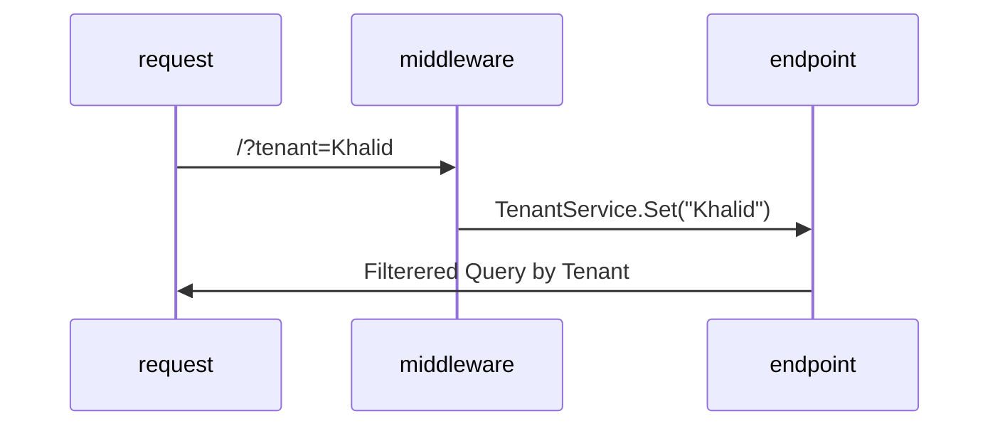

I followed article of JetBrain-Blogs https://blog.jetbrains.com/dotnet/2022/06/22/multi-tenant-apps-with-ef-core-and-asp-net-core/

```mermaid
sequenceDiagram
    participant request
    participant middleware
    participant endpoint    
    request->>middleware: /?tenant=Khalid
    middleware->>endpoint: TenantService.Set("Khalid")
    endpoint->>request: Filterered Query by Tenant
```
